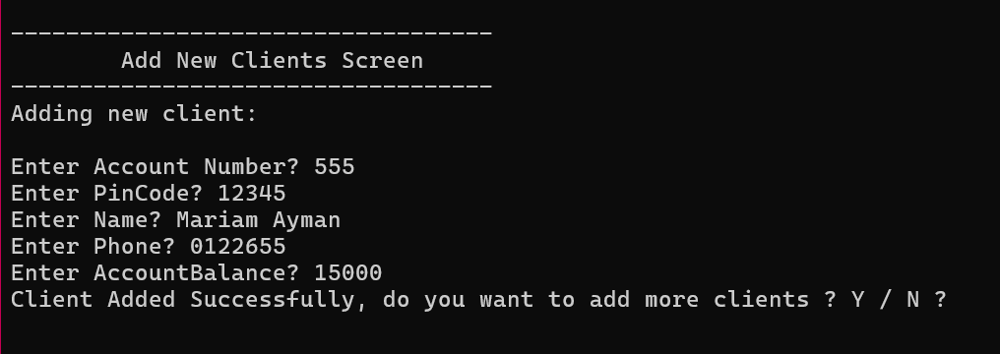
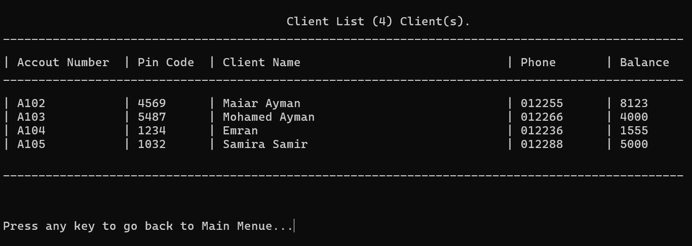
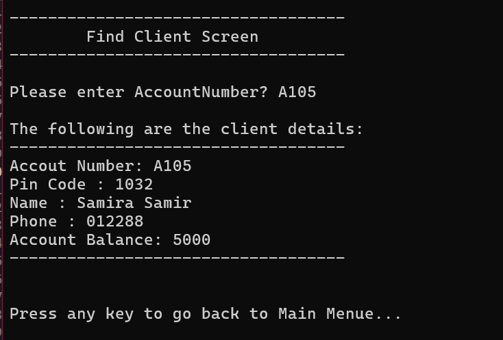
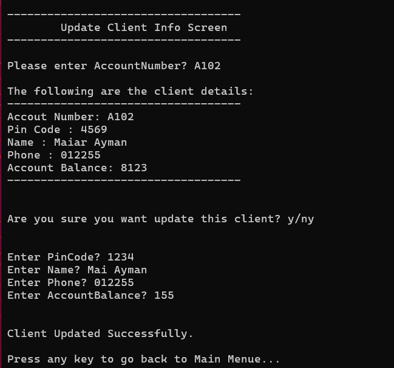
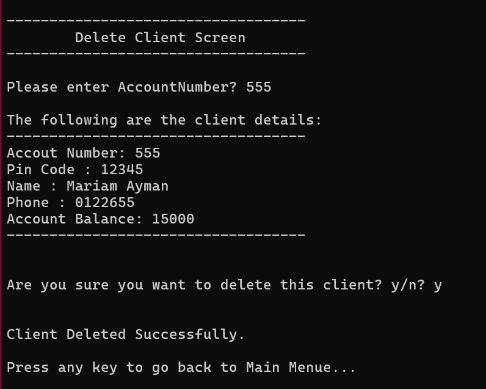
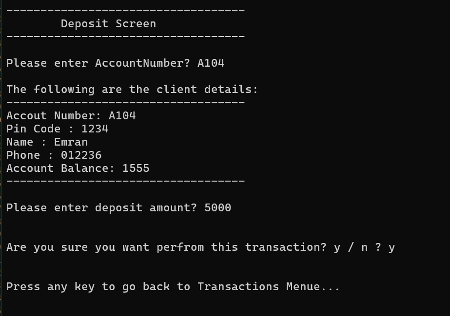
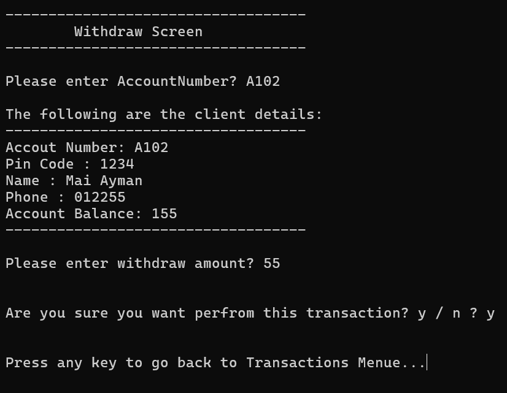
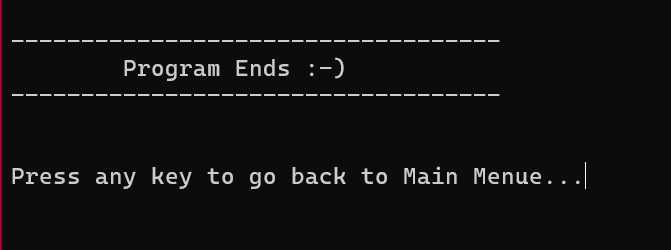

# Bank Management System (C++)

A robust console-based application built with **C++** to manage bank clients and transactions. This project demonstrates core programming concepts such as File Handling, Data Structures (Vectors), Enums, and Structs.

##  Features
- **Client Management:** Add, Delete, Update, and Find clients.
- **Transaction Module:** Deposit and Withdraw operations with balance validation.
- **Data Persistence:** All data is saved and loaded from a text file (`Clients.txt`).
- **Input Validation:** Handles incorrect inputs to ensure program stability.

## Technical Skills Demonstrated
- **File Handling:** Reading and writing structured data.
- **Data Structures:** Efficiently using `std::vector` for memory management.
- **Clean Code:** Modular functions and clear naming conventions.
- **Logic Handling:** Implementing a multi-menu system (Main Menu & Transactions).

## Visual Tour

Here is a step-by-step look at the application's interface:

### 1. Main Menu Screen
This is the central hub of the application where you choose between client management and transactions.

### 2. Client Management Actions

#### Adding a New Client
Seamlessly add new client data to the system.

#### Viewing Client List
A clean, formatted table showing all currently registered clients.

#### Finding a Client
Quickly look up a specific client's details using their account number.

#### Updating Client Info
Easily modify existing client information.

#### Deleting a Client
A secure deletion process with a confirmation step.

### 3. Transactions Module

#### Transactions Menu Screen
Navigate through different financial operations.

#### Making a Deposit
Process deposit transactions with a confirmation prompt.

#### Making a Withdraw
Handle withdrawals with balance check and confirmation.

### 4. Application Exit Screen

## How to Run
1. Clone the repository.
2. Ensure you have a C++ compiler (like GCC or MinGW).
3. Compile the file: `g++ main.cpp -o BankSystem`
4. Run the executable: `./BankSystem`