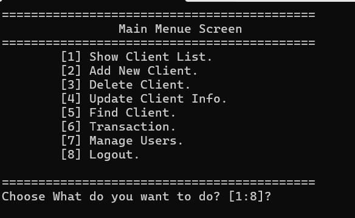
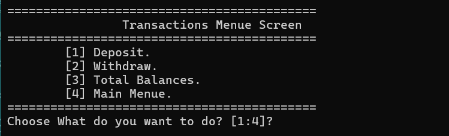
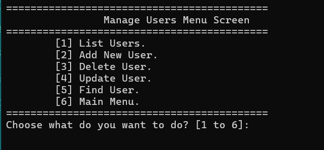

# Bank Management System (C++)

A modular console-based **Bank Management System** developed in **C++**.

## Features

### Authentication
- User Login System.
- Username & Password verification.

### User Management
- Add new users.
- Delete users.
- Update user information.
- Find users.
- Permission management.

### Client Management
- Add new clients.
- Update client information.
- Delete clients.
- Search for clients.
- Display all clients.

### Transactions
- Deposit.
- Withdraw.
- Display total balances.
- Balance validation.
- Confirmation before transactions.

### Authorization
Role-Based Access Control (RBAC) using bitmask permissions:
- List Clients
- Add Client
- Delete Client
- Update Client
- Find Client
- Transactions
- Manage Users
- Full Access (Admin)

### Data Storage
- Client data stored in `Clients.txt`
- User data stored in `Users.txt`
- Persistent file-based storage

---

## Technologies Used

- C++
- File Handling
- STL (`vector`)
- Structs
- Enums
- Modular Programming
- Bitmask Permissions

---

## Project Structure

```
Bank/
│
├── Client.cpp / Client.h
├── User.cpp / User.h
├── Transaction.cpp / Transaction.h
├── Utility.cpp / Utility.h
├── Global.h
├── Bank.cpp
├── Clients.txt
└── Users.txt
```

---

## Screenshots

### Login


### Main Menu



### Transactions



### User Management



---

## How to Run

1. Clone the repository.

```bash
git clone https://github.com/your-username/BankSystem.git
```

2. Open the solution in Visual Studio.

3. Build the project.

4. Run the application.

---